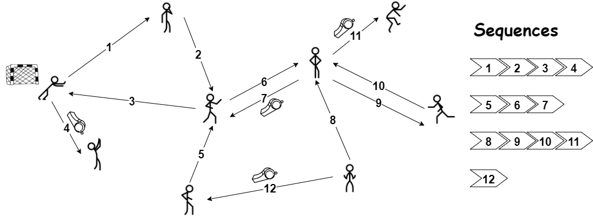
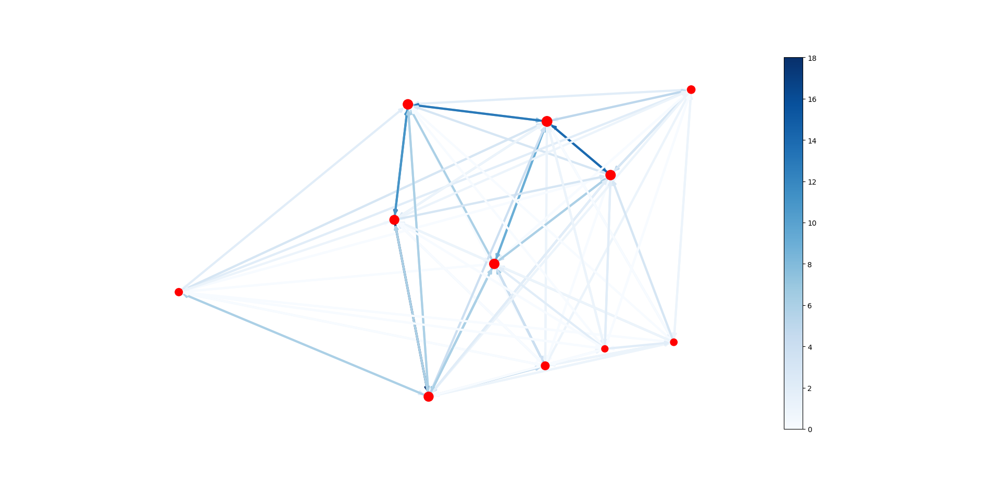

# [ICM2020_MicroscopicAnalysis](https://github.com/congee524/ICM2020_MicroscopicAnalysis)

2020美赛D题，我所负责的微观分析部分代码，围绕motif展开

用到了pytorch和networkx这两个anaconda不自带的库

我画的图 ↑ ，哈哈哈

D题是一个踢球题，给了Huskies这只足球队38场比赛的数据，包括传球等各个事件，要求进行分析，给出建议等等

## 代码框架

- data存放的是官方给的数据
- image存放用于生成passing network图片所用到的数据和最终结果
- output存放各程序的输出结果

## 文件解释

### CalGrade.py

该部分根据比赛中出现的motif，来进行比赛结果的预测，涉及到对motif的评分，我们的评价指标主要涉及到前进距离 $dis$ 和犯规距离比 $\frac{duel}{dis}$，我设计了如下公式进行比赛结果的预测
$$
\tanh (\Sigma_{i=1}^{15} k_i(P(Husk)_i - P(Oppo)_i)(\alpha \cdot dis + \beta \cdot \frac{duel}{dis}))
$$
win 为 1，loss 为 -1，tie 为 0

以MSE做loss function，梯度下降

### DrawPassingNetwork

绘制passing network，结点大小由closeness决定，边的颜色和透明度由传球次数决定

### Partition

划分sequences用，并查出每个sequences中包含的所有motif，主要使用了Permutation遍历暴力搜索